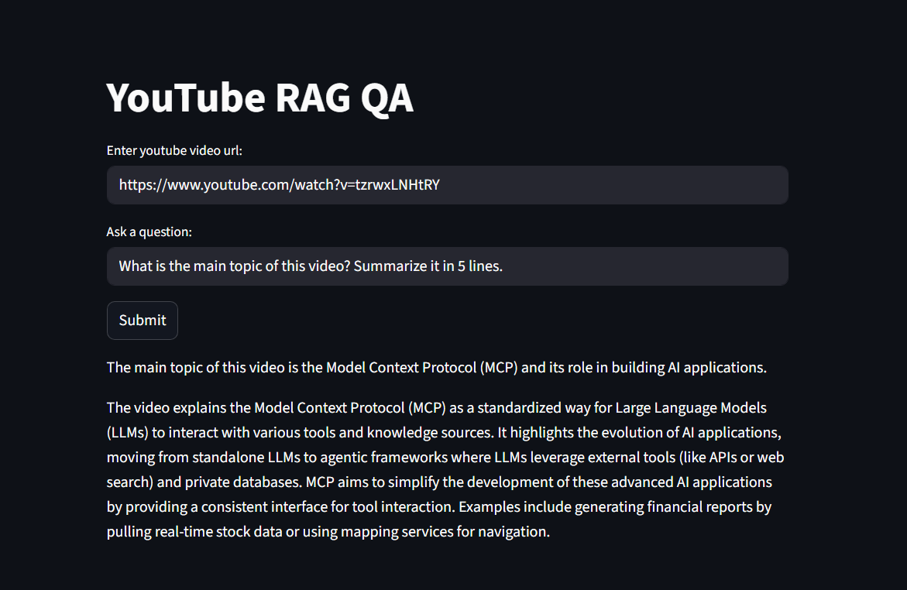

# 📺 YouTube QnA Chatbot (RAG)

A Retrieval-Augmented Generation (RAG) powered chatbot that takes a YouTube video link, extracts its transcript, builds a knowledge base, and allows you to ask questions directly about the video content.

Built with:

LangChain (RAG pipeline)

Google Generative AI (Gemini) for embeddings + chat model

FAISS for vector search

Streamlit for frontend

## Live Demo  
👉 [Try it on Streamlit](https://youtubeqnachatbotrag-gnfzvd2eqezxpac23p9hth.streamlit.app/)  

## 🚀 Features

Fetches transcript from YouTube videos

Splits text into chunks for efficient retrieval

Embeds video transcript into a FAISS vector store

Uses Gemini chat model for question answering

Simple Streamlit UI

## 📂 Project Structure
YouTube_QnA_RAG/
│── app.py                # Main Streamlit app
│── requirements.txt      # Dependencies
│── README.md             # Documentation

## ⚙️ Installation

Clone the repo:

git clone https://github.com/yourusername/YouTube_QnA_RAG.git
cd YouTube_QnA_RAG

Install dependencies:

pip install -r requirements.txt

## 🔑 API Key Setup

This project uses Google Generative AI (Gemini).
Instead of storing your key in .env, use Streamlit Secrets Manager.

### Option 1: Local Development

Create a .streamlit/secrets.toml file:

[general]
GOOGLE_API_KEY = "your_api_key_here"

### Option 2: Streamlit Cloud Deployment

Go to Streamlit Cloud → Settings → Secrets

Add your API key as:

GOOGLE_API_KEY="your_api_key_here"

## ⚠️ Note: Never push your API key or .env file to GitHub. Use .gitignore to exclude sensitive files.

## ▶️ Run the App
streamlit run app.py

## 📝 Example Usage

Enter a YouTube video link

The app fetches transcript + builds FAISS knowledge base

Ask questions like:

"What is the main topic of the video?"

"Summarize the key points."

## 🛠️ Tech Stack

Python

Streamlit

LangChain

FAISS

Google Generative AI (Gemini)

YouTube Transcript API

## 📌 Notes

Only works for videos with available transcripts

Make sure you add your GOOGLE_API_KEY in Streamlit secrets before running

## Inference

